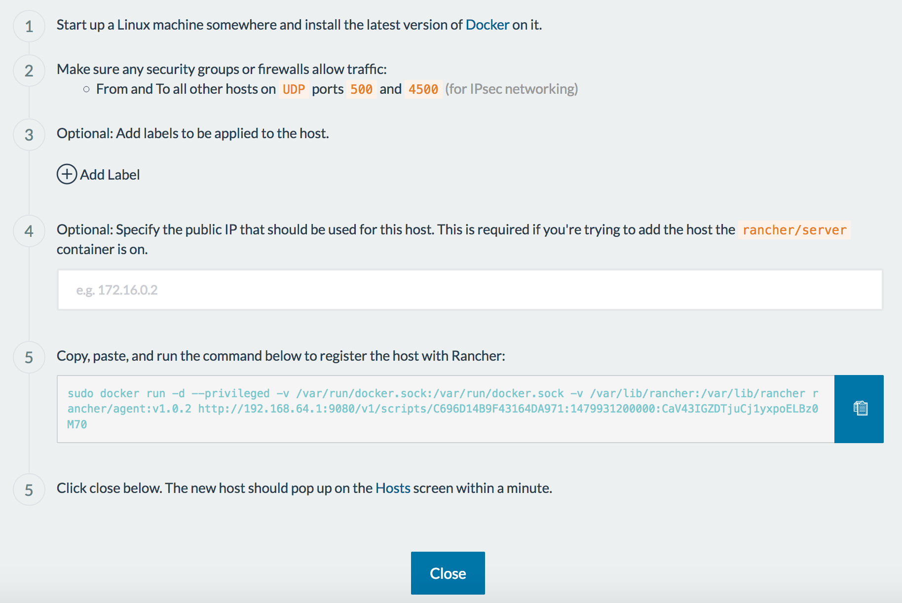

# xhyve Rancher Setup

Here are the steps to set up a 3-node Rancher Cluster on your MacOS Laptop using [xhyve](https://github.com/mist64/xhyve) (adopted from [here](https://gist.github.com/axnux/09dc375d71398cbbee44ebd23ba35a08)).

## Install [Docker for Mac](https://docs.docker.com/docker-for-mac/)

## Install [docker-machine-driver-xhyve](https://github.com/zchee/docker-machine-driver-xhyve)

```hcl
$ brew install docker-machine-driver-xhyve 
$ sudo chown root:wheel $(which docker-machine-driver-xhyve)
$ sudo chmod u+s $(which docker-machine-driver-xhyve)
```
## Install latest [Rancher](http://rancher.com) version

```hcl
$ docker run -d --privileged -p 9080:8080 --restart=unless-stopped --name=rancher-server rancher/server:latest
$ docker logs -f rancher-server
$ open http://localhost:9080  #  also reachable at http://192.168.64.1:9080 
```
## Create 3 Rancher hosts using xhyve

```hcl
$ docker-machine create --driver=xhyve --xhyve-memory-size='512' --xhyve-boot-cmd='loglevel=3 user=docker console=ttyS0 console=tty0 noembed nomodeset norestore waitusb=10 base host=host1' rancher-host1 
$ docker-machine create --driver=xhyve --xhyve-memory-size='512' --xhyve-boot-cmd='loglevel=3 user=docker console=ttyS0 console=tty0 noembed nomodeset norestore waitusb=10 base host=host2' rancher-host2 
$ docker-machine create --driver=xhyve --xhyve-memory-size='512' --xhyve-boot-cmd='loglevel=3 user=docker console=ttyS0 console=tty0 noembed nomodeset norestore waitusb=10 base host=host3' rancher-host3
```

## Wait until all Rancher hosts are up  

```hcl
$ docker-machine ls
NAME            ACTIVE   DRIVER   STATE     URL                        SWARM   DOCKER    ERRORS
rancher-host1   -        xhyve    Running   tcp://192.168.64.11:2376           v1.12.3
rancher-host2   -        xhyve    Running   tcp://192.168.64.12:2376           v1.12.3
rancher-host3   -        xhyve    Running   tcp://192.168.64.13:2376           v1.12.3
```

## Add hosts to Rancher using the command the UI shows (use your URL!!)

```hcl
$ docker-machine ssh rancher-host1 sudo docker run -e CATTLE_AGENT_IP=$(ifconfig eth0 | grep "inet " | awk -F'[: ]+' '{ print $4 }') -d --privileged -v /var/run/docker.sock:/var/run/docker.sock -v /var/lib/docker/rancher:/var/lib/rancher rancher/agent:v1.0.2 http://192.168.64.1:9080/v1/scripts/C696D1400F43164DA971:1479909601100:ggFpLItZz1tvk0XP34RfuaJ8YfM
$ docker-machine ssh rancher-host2 sudo docker run -e CATTLE_AGENT_IP=$(ifconfig eth0 | grep "inet " | awk -F'[: ]+' '{ print $4 }') -d --privileged -v /var/run/docker.sock:/var/run/docker.sock -v /var/lib/docker/rancher:/var/lib/rancher rancher/agent:v1.0.2 http://192.168.64.1:9080/v1/scripts/C696D1400F43164DA971:1479909601100:ggFpLItZz1tvk0XP34RfuaJ8YfM
$ docker-machine ssh rancher-host3 sudo docker run -e CATTLE_AGENT_IP=$(ifconfig eth0 | grep "inet " | awk -F'[: ]+' '{ print $4 }') -d --privileged -v /var/run/docker.sock:/var/run/docker.sock -v /var/lib/docker/rancher:/var/lib/rancher rancher/agent:v1.0.2 http://192.168.64.1:9080/v1/scripts/C696D1400F43164DA971:1479909601100:ggFpLItZz1tvk0XP34RfuaJ8YfM
```
 (Image to be added)

to be continued...

